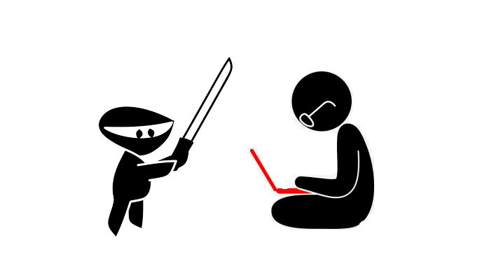

### Involves taking on the code-kata challenge from the PyMasters channel. 
Solutions for tasks from website https://www.codewars.com

All kata are included in the "kata" directory.

1. 1_kata.py - return an array, where the first element is the count of positives numbers and the second element is sum of negative numbers. 0 is neither positive nor negative.
2. 2_kata.py -  a function that turns a string into a **Mexican Wave**.
3. three_kata.py - translator from **DNA** to **RNA**.
4. four_kata.py - **multiplicative** persistence
5. five_kata.py - **count values** in string
6. six_kata.py - return a list with only your **friends** name
7. seven_kata.py - return reverse string

### Tests
Not all exercises have tests - it depends on my free time and energy.
To run the tests, You need to run:
```shell
pytest -v
```


